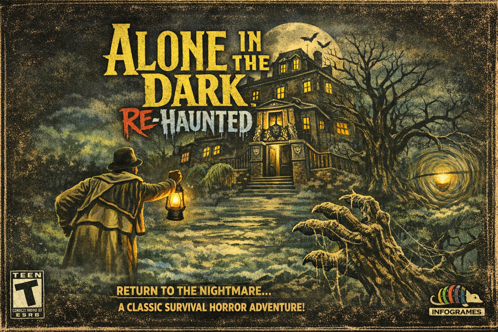

# AloneInTheDarkReHaunted
# Alone In The Dark: Re-Haunted

**A faithful remaster of the original 1992 survival horror classic.**

*Copyright © 2026 Infogrames / Spacefarer Retro Remasters LLC*
*Author: Jake Jackson (jake@spacefarergames.com)*

.png)
.png)
.png)

---

## About

**Alone In The Dark: Re-Haunted** is a modern remaster of the landmark 1992 survival horror game by Infogrames. Built on the reverse-engineered FITD engine, Re-Haunted preserves the original gameplay while adding modern rendering, HD backgrounds, post-processing effects, gamepad support, and quality-of-life improvements.



## System Requirements

- **OS:** Windows 10/11 (64-bit)
- **CPU:** Any modern x86-64 processor
- **RAM:** 4 GB minimum (8 GB recommended for HD backgrounds)
- **GPU:** DirectX 11 / OpenGL 3.2 / Vulkan compatible
- **Storage:** ~2 GB for base game + HD assets
- **Original game data files required** (PAK/ITD files from the original release)

## Building from Source

### Prerequisites

- CMake 3.10+
- Visual Studio 2022 or later (MSVC)
- C++20 compiler support

### Build Steps

```bash
# Clone the repository
git clone https://github.com/yaz0r/FITD.git
cd FITD

# Create build directory
mkdir build && cd build
mkdir vs2026 && cd vs2026

# Generate project files
cmake ../..

# Build (Release configuration)
cmake --build . --config Release
```

The executable `Tatou.exe` will be output to `build/vs2026/Fitd/Release/`.

### Packing HD Assets

HD background images and audio can be packed into single archive files for distribution:

```powershell
# Pack HD backgrounds (1941 files → single .hda archive)
powershell -ExecutionPolicy Bypass -File FitdLib/pack_backgrounds.ps1 "path/to/backgrounds_hd"

# Pack audio files (MP3 music + WAV sound effects → single .hda archive)
powershell -ExecutionPolicy Bypass -File FitdLib/pack_audio.ps1 "path/to/game/folder"
```

## Running

Place `Tatou.exe` alongside the original game's data files (PAK, ITD) in the same directory. The game auto-detects which title to run based on the data files present.

### Required Files

- Original game PAK files (e.g., `LISTBOD2.PAK` for AITD1)
- Original game ITD files (`DEFINES.ITD`, `OBJETS.ITD`)

### Optional Files

| File | Purpose |
|------|---------|
| `backgrounds_hd.hda` | HD background archive (static + animated) |
| `audio.hda` | Music and sound effects archive |
| `backgrounds_hd/` | Loose HD background files (fallback if no archive) |
| `*.mp3` / `*.ogg` / `*.wav` | Loose music tracks (fallback if no archive) |
| `BLKCHCRY.TTF` | TrueType font for remastered text |
| `version.txt` | Version string displayed in window title |
| `aitd_remaster.cfg` | Remaster configuration file |

## Configuration

Settings are stored in `aitd_remaster.cfg` and can be edited in-game through the options menu.

### Graphics

| Setting | Default | Description |
|---------|---------|-------------|
| `enableHDBackgrounds` | `false` | Enable high-definition background rendering |
| `backgroundScale` | `2` | Background resolution multiplier (2x = 640×400) |
| `enableFiltering` | `true` | Texture filtering on backgrounds |
| `enableBlurredMenu` | `false` | Gaussian blur on background during menus |

### Post-Processing

| Setting | Default | Description |
|---------|---------|-------------|
| `enableBloom` | `true` | HDR bloom lighting effect |
| `bloomThreshold` | `0.6` | Brightness threshold for bloom |
| `bloomIntensity` | `0.5` | Bloom strength |
| `enableFilmGrain` | `true` | Cinematic film grain overlay |
| `filmGrainIntensity` | `0.03` | Film grain strength |
| `enableSSAO` | `true` | Screen-space ambient occlusion |

### Controller

| Setting | Default | Description |
|---------|---------|-------------|
| `enableController` | `true` | Gamepad support (SDL3) |
| `analogDeadzone` | `0.15` | Analog stick dead zone |
| `analogSensitivity` | `1.0` | Analog stick sensitivity |
| `invertYAxis` | `false` | Invert vertical axis |
| `analogMovement` | `true` | Analog stick movement (vs. digital only) |

### Font

| Setting | Default | Description |
|---------|---------|-------------|
| `enableTTF` | `false` | TrueType font rendering |
| `fontPath` | `BLKCHCRY.TTF` | Path to TTF font file |
| `fontSize` | `16` | Font size in points |
| `hideOriginalText` | `true` | Hide original bitmap text when TTF is active |

## Controls

### Keyboard (Default)

| Action | Key |
|--------|-----|
| Move Up | ↑ Arrow |
| Move Down | ↓ Arrow |
| Turn Left | ← Arrow |
| Turn Right | → Arrow |
| Action / Use | Space |
| Inventory / Confirm | Enter |
| Menu / Cancel | Escape |
| Prev Inventory | Q |
| Next Inventory | E |

### Gamepad (Default)

| Action | Button |
|--------|--------|
| Move | Left Stick / D-Pad |
| Action / Use | A (South) |
| Inventory / Confirm | Start |
| Cancel | B (East) |
| Prev Inventory | Left Bumper |
| Next Inventory | Right Bumper |

All key and gamepad bindings are fully remappable through the controls menu.

## Architecture

### Technology Stack

| Component | Technology |
|-----------|-----------|
| Language | C++20 |
| Build System | CMake |
| Windowing / Input | SDL3 |
| 3D Rendering | bgfx (DirectX 11 / OpenGL / Vulkan / Metal) |
| Audio | SoLoud (with OGG/MP3/WAV support) |
| Image Loading | stb_image |
| UI (Debug) | Dear ImGui |
| Compression | zlib |

### Project Structure

```
FITD/
├── Fitd/               # Executable project (Tatou.exe)
│   ├── Tatou.rc        # Windows resource file (icon)
│   └── Tatou.ico       # Application icon
├── FitdLib/            # Core engine static library
│   ├── embedded/       # Embedded PAK/ITD data (C++ byte arrays)
│   ├── shaders/        # bgfx shader source files (.sc)
│   ├── hdArchive.*     # HD archive format reader
│   ├── hdBackground.*  # HD background loading (static + animated)
│   ├── hdBackgroundRenderer.* # HD background GPU rendering
│   ├── rendererBGFX.*  # bgfx 3D rendering pipeline
│   ├── postProcessing.*# Bloom, film grain, SSAO
│   ├── fontTTF.*       # TrueType font rendering
│   ├── configRemaster.*# Remaster settings management
│   ├── controlsMenu.*  # Input configuration UI
│   ├── exceptionHandler.* # Crash protection & minidump
│   ├── memoryManager.* # Allocation tracking & corruption detection
│   ├── resourceGC.*    # Deferred resource garbage collector
│   └── ...             # Original FITD engine source
└── ThirdParty/         # External dependencies
    ├── bgfx.cmake/     # bgfx rendering library
    ├── SDL/            # SDL3 platform abstraction
    └── soloud.cmake/   # SoLoud audio library
```

### Asset Archive Format (.hda)

Both `backgrounds_hd.hda` and `audio.hda` share the same binary format:

```
Header (12 bytes):
  [4] Magic: "HDBG" (0x47424448 little-endian)
  [4] Version: 1
  [4] Entry count

Table of Contents (repeated per entry):
  [2] Path length (uint16)
  [N] Relative path (UTF-8, forward slashes)
  [8] Data offset from file start (uint64)
  [8] Data size in bytes (uint64)

Data Section:
  Raw file bytes concatenated (no re-compression)
```

## Credits

- **Original Game:** Infogrames (1992) — Frédérick Raynal, Franck de Girolami, et al.
- **Reverse Engineering:** Yaz0r ([github.com/yaz0r/FITD](https://github.com/yaz0r/FITD))
- **Remaster:** Jake Jackson / Spacefarer Retro Remasters LLC

## License

This project is a remaster built on the reverse-engineered FITD engine. Original game data files are required and not included. See the original [FITD repository](https://github.com/yaz0r/FITD) for engine licensing details.

# Release Notes — Alone In The Dark: Re-Haunted

---

## Version 1.0.0 — Initial Release

### ✨ Remaster Features

#### HD Background System
- **High-definition pre-rendered backgrounds** replacing the original 320×200 artwork
- **Animated backgrounds** with multi-frame playback (e.g., flickering lights, water ripples)
- Configurable resolution scale (default 2×: 640×400)
- Progressive frame loading with minimum-frame-for-playback threshold
- **HD Background Archive** (`backgrounds_hd.hda`) — all 1,941 background images packed into a single file for clean distribution
- Filesystem fallback: loose files in `backgrounds_hd/` are supported if no archive is present
- Memory-mapped file loading on Windows for maximum I/O throughput
- HD frame border overlays for cinematic letterboxing

#### Modern Rendering Pipeline
- **bgfx hardware-accelerated rendering** with backend support for:
  - DirectX 11
  - OpenGL 3.2+
  - Vulkan
  - Metal (macOS)
- Background texture management with proper GPU resource lifecycle

#### Post-Processing Effects
- **Bloom** — HDR bright-pass extraction with configurable threshold and intensity
- **Film Grain** — cinematic noise overlay for atmospheric effect
- **Screen-Space Ambient Occlusion (SSAO)** — depth-based contact shadows
- All effects independently toggleable with per-parameter tuning

#### TrueType Font Rendering
- Optional TTF font overlay for all in-game text (menus, dialogue, inventory)
- Ships with `BLKCHCRY.TTF` (Blackadder-style gothic font) by default
- Configurable font size with proper glyph spacing
- Option to hide original bitmap text when TTF is active

#### Full Gamepad Support
- SDL3-based controller input with analog stick and D-pad support
- Analog movement with configurable deadzone and sensitivity
- Fully remappable keyboard and gamepad bindings through in-game menu
- Default mappings for standard Xbox/PlayStation-style gamepads

#### Remastered Audio
- **External music playback** — MP3, OGG, and WAV music tracks replace the original AdLib/MIDI
- **Audio Archive** (`audio.hda`) — all music tracks and UI sound effects packed into a single file
- SoLoud audio engine with streaming playback for music
- UI sound effects (navigation, selection, back, expand) for menu interactions
- Filesystem fallback for loose audio files if no archive is present

#### Menu System
- **Startup menu** with new game / load game / quit options
- **In-game pause menu** with save/load, options, and controls configuration
- **Controls configuration menu** for remapping keyboard and gamepad bindings
- Menu navigation sounds
- Blurred background option during menus

---

### 🛠 Engine Improvements

#### Embedded Game Data
- Critical PAK and ITD game data files embedded directly as C++ byte arrays
- 37 data files compiled into the executable — eliminates dependency on loose ITD/PAK files for core engine initialization
- Automatic fallback: embedded data is tried first, then filesystem

#### Stability & Crash Protection
- **Vectored Exception Handler (VEH)** — catches access violations, stack overflows, heap corruption, and illegal instructions
- **SEH wrappers** on game thread entry points for belt-and-suspenders crash protection
- **Minidump generation** on crash for post-mortem debugging
- **PROTECTED_CALL macro** — wraps critical operations (stb_image decoding, bgfx resource creation) in structured exception handling
- Crash log file output with timestamps and stack context

#### Memory Management
- **MemoryManager** — allocation tracker with canary-based corruption detection
- **SAFE_MALLOC / SAFE_FREE** — tracked allocation wrappers with file/line tagging
- **TRACK_ALLOCATION / UNTRACK_ALLOCATION** — monitors stb_image and third-party allocations
- Debug memory log (`memory_debug.log`) with leak detection on shutdown

#### Resource Lifecycle
- **ResourceGC** — deferred garbage collector for large HD background assets
- Prevents out-of-memory during camera transitions by scheduling old background cleanup
- Frame-based tick with configurable delay before final free
- Flush-on-demand before loading new large assets
- Clean shutdown with `onShutdown()` to prevent heap corruption at exit

#### Bug Fixes
- **Sound never stops bug** — previous sound effects are now properly stopped before playing new ones, preventing overlapping/stuck audio
- **Player stuck after cellar→caves transition** — added NULL checks in animation code to prevent crashes on missing animation data
- **Door shadow rendering** — conditional rendering with `INFO_ANIM` check in both `AllRedraw()` and `drawSceneObjects()` to prevent visual artifacts
- **Player stuck in walls** — `fixPlayerStuckInWall()` recovery function
- **Stale file cleanup** — removed orphaned source files that caused build issues
- **Double-free crashes** — explicit pointer nullification after free in HD background cleanup
- **Frame timing** — delta time capping prevents animation speed-up after loading pauses

#### Configuration System
- **INI-style configuration file** (`aitd_remaster.cfg`) with sections for graphics, post-processing, audio, controller, font, and controls
- Persistent save/load of all settings
- Sensible defaults initialized on first run

#### Version Detection
- `version.txt` support — version string displayed in the window title bar
- Automatic game detection from data files with per-game CVar table initialization

---

### 📦 Distribution

#### Archive Format (.hda)
Both `backgrounds_hd.hda` and `audio.hda` use the **HDBG** binary archive format:
- Single-file container with table-of-contents header
- 64-bit offsets for archives up to 16 EB
- Case-insensitive entry lookup
- Prefix-based directory listing for animated background frame enumeration
- No re-compression — raw file data stored as-is for maximum loading speed
- PowerShell packing scripts included (`pack_backgrounds.ps1`, `pack_audio.ps1`)

#### Asset Summary

| Archive | Entries | Size | Contents |
|---------|---------|------|----------|
| `backgrounds_hd.hda` | 1,941 | ~1.8 GB | Static + animated PNG backgrounds |
| `audio.hda` | 21 | ~40 MB | 17 MP3 music tracks + 4 WAV sound effects |

#### Executable
- **Tatou.exe** — single Windows executable with custom application icon
- Embedded PAK/ITD data for core initialization (no loose files needed for engine bootstrap)
- All third-party libraries statically linked

---

### 🔧 Build Information

| Component | Version |
|-----------|---------|
| Compiler | MSVC (Visual Studio 2026) |
| C++ Standard | C++20 |
| Build System | CMake 3.10+ |
| SDL | SDL3 |
| bgfx | Latest (via bgfx.cmake) |
| SoLoud | Latest (via soloud.cmake) |
| stb_image | Bundled (via bimg) |
| zlib | Bundled |

---

### Known Limitations

- HD backgrounds require original game data files to determine camera indices
- Post-processing effects require a GPU with shader model 4.0+ support
- Audio archive does not support streaming from archive (music is loaded fully into memory before playback)
- AdLib/OPL music emulation is available but external MP3/OGG tracks are recommended for best quality
- `Time Gate: Knight's Chase` CVar table support is provisional

---

*Alone In The Dark: Re-Haunted — Because some mansions deserve to be revisited.*

